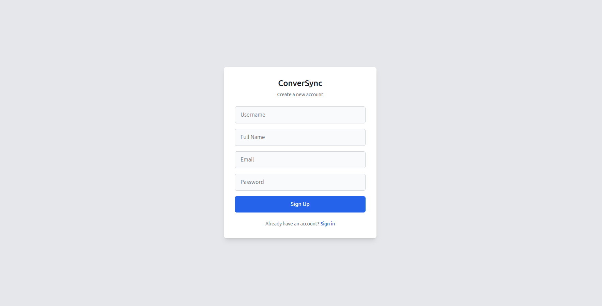
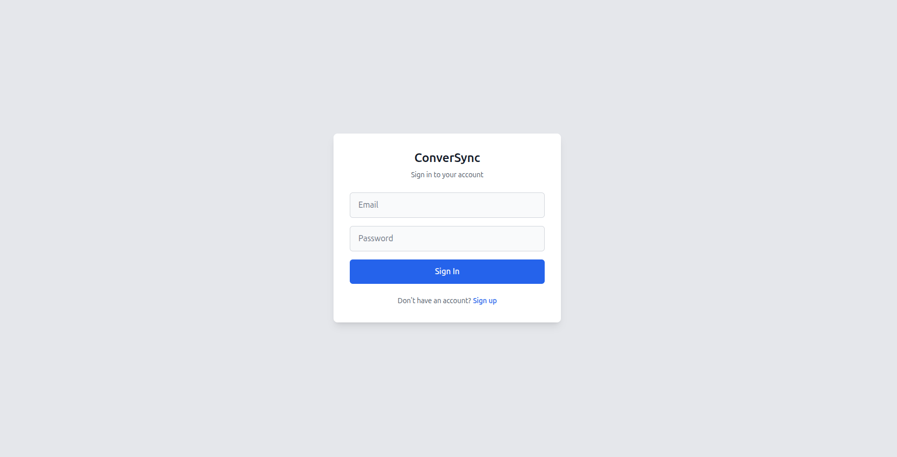
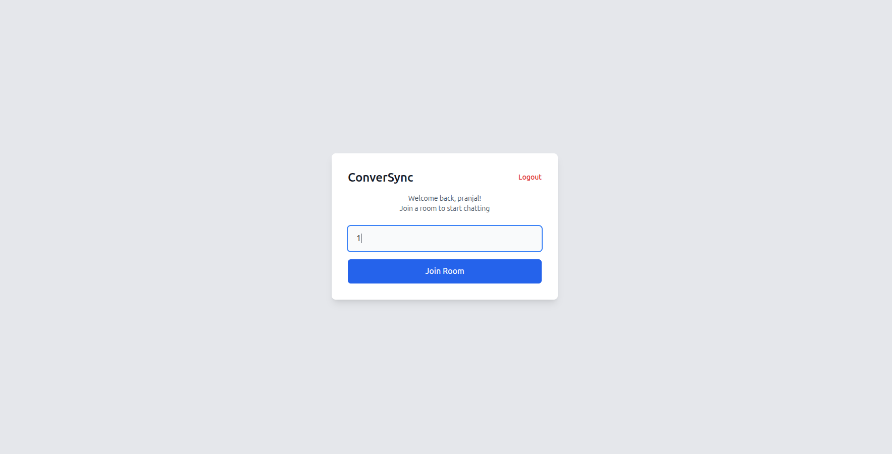
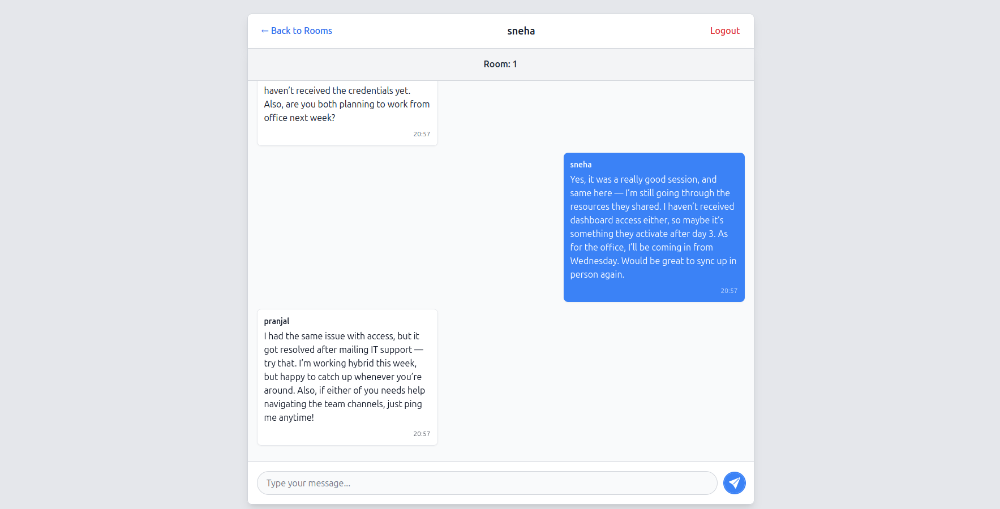

#  ConverSync

**ConverSync** is a full-stack real-time chat application where users can register, join unique chat rooms, and message others instantly — all with a clean UI and secure authentication. Built using **ReactJS**, **TypeScript**, **Node.js**, **Socket.IO**, and **MongoDB**.

---

## Features

-  **Secure Authentication**
  - Register & Login with JWT and bcrypt
  - Validated input using Zod

-  **Real-Time Messaging**
  - Join any room using a unique Room ID
  - Send and receive messages via WebSockets (`socket.io`)
  - Messages are (real-time only)

-  **Modern UI**
  - Clean and responsive design with Tailwind CSS
  - Seamless navigation between pages

-  **Tech-Enhanced**
  - TypeScript for type safety (frontend)
  - Zod validation
  - React functional components and hooks

---

##  Tech Stack

| Layer         | Tech                         |
|---------------|------------------------------|
| Frontend      | ReactJS, TypeScript, Tailwind CSS |
| Backend       | Node.js, Express.js, Socket.IO |
| Auth & Validation | JWT, bcrypt, Zod             |
| Database      | MongoDB (user credentials only) |
| Realtime Layer| Socket.IO (WebSocket)         |
| Miscellaneous | JavaScript, dotenv            |

---

##  Screenshots

| Sign Up | Login | Join Room | Live Chat |
|-------------|------------|------------|
|  |  |  |  |

---
